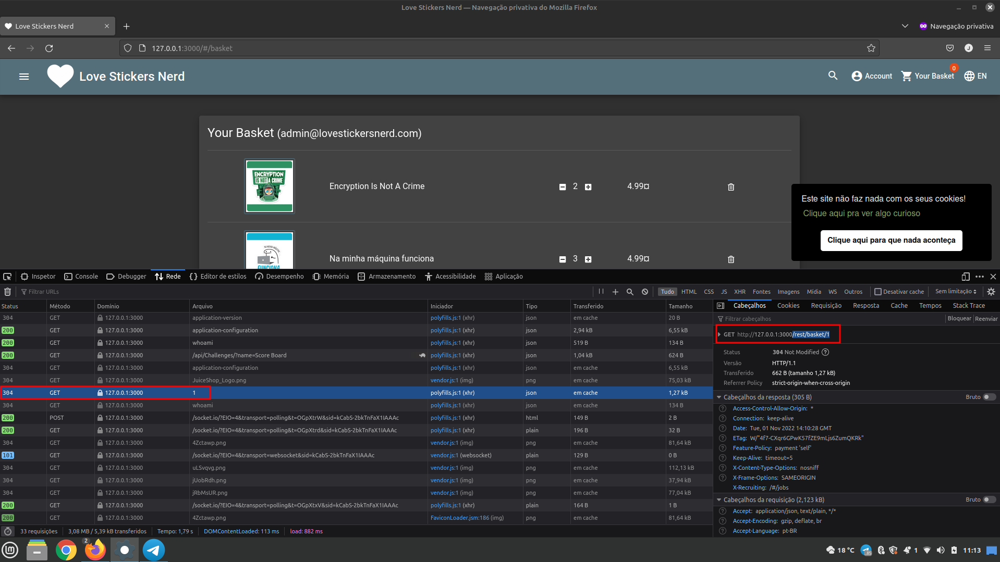
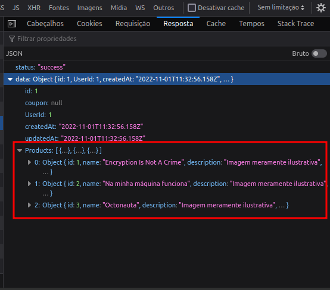
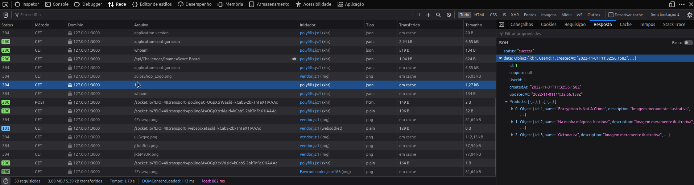

#  Love Stickers Nerd - Desafios

### 1. Acesse a aplicação e navegue por todas as telas. Esta fase é conhecida como **reconhecimento**. Identifique as telas e qualquer informação que parecer útil.  

**Desafio: Qual parâmetro é usado para pesquisar?**

- 

    
<b>Dica extra:</b>

    Use as ferramentas de desenvolvedor
    (<a href="https://developer.chrome.com/docs/devtools/" target="_blank">Chrome DevTools</a>) para dar uma espiada no que acontece debaixo do capô e observe todas as URLs que acessar.

    
 

### 2. Anote tudo aquilo que você achar interessante como diretórios, links ou informações de usuário ou email.

**Desafio: Qual é o endereço de e-mail do administrador?**

- 

    
<b>Dica extra:</b>

    Alguns produtos pode conter comentários úteis.

    
 

## OWASP's TOP 10 vulnerabilities

  O [OWASP Top 10](https://owasp.org/www-project-top-ten/) é um documento de conscientização padrão para desenvolvedores e segurança de aplicativos da web. Ele representa um amplo consenso sobre os riscos de segurança mais críticos para aplicativos da web.

  As empresas devem adotar este documento e iniciar o processo de garantir que suas aplicações web minimizem esses riscos. Usar o OWASP Top 10 talvez seja o primeiro passo mais eficaz para mudar a cultura de desenvolvimento de software em sua organização para uma que produza um código mais seguro.

  O [Pwning OWASP Juice Shop](https://pwning.owasp-juice.shop/) é um aplicativo grande, portanto, não abordaremos todos os tópicos do top 10.
  No entanto, abordaremos os tópicos a seguir, que recomendamos que você dê uma olhada na documentação à medida que avançar nos items.  

## 1. [Injection](https://owasp.org/www-project-top-ten/OWASP_Top_Ten_2017/Top_10-2017_A1-Injection.html):

Esse tipo de falha é muito conhecida pela técnica **SQL Injection**, onde o invasor realiza consultas indevidas no banco de dados, por meio de um formulário ou URL. [Leia mais sobre o desafio Injection](https://pwning.owasp-juice.shop/part2/injection.html).

**Desafio 1: Faça login na conta de administrador!**

- 

    
<b>Resolução:</b>

    Vá até a página de login e tente se autenticar com qualquer usuário e senha.

    Agora substitua o usuário pelo seguinte:
    `jim' or 1=1--` e tente logar-se novamente.

    **Por que isso funciona?**  
    
    - O caractere `'` fechará os colchetes na consulta SQL.
    
    - ' `OR` ' em uma instrução SQL retornará true se um dos lados for true. Como  `1=1` é sempre verdadeiro , toda a afirmação é verdadeira. Assim, ele informará ao servidor que o e-mail é válido e nos fará login no  ID de usuário **0** , que por acaso é a conta do administrador.
    
    - O  caractere `--`  é usado no SQL para comentar os dados, quaisquer restrições no login não funcionarão mais, pois são interpretadas como um comentário. Isso é como o  comentário` #`  e  `//`  em python e javascript, respectivamente.
 
    
 

**Desafio 2: Faça login na conta do Bender!**

- 

    
<b>Resolução:</b>

    Semelhante ao que fizemos no desafio 1, desta vez colocaremos: `bender@lovestickersnerd.com'--`  como email de login e qualquer senha. 

    **Por que isso funciona?**  
    - Como sabemos exatamente qual é o endereço de e-mail e é um endereço válido (que retornará  true ), não precisamos forçá-lo a ser  true. Assim, podemos usar  `'--` para ignorar o sistema de login. Observe que `1=1` pode ser usado quando o e-mail ou nome de usuário não é conhecido ou é inválido.

    
 

## 2. [Broken Authentication](https://owasp.org/www-project-top-ten/OWASP_Top_Ten_2017/Top_10-2017_A2-Broken_Authentication.html): 

Essa falha ocorre quando o sistema não utiliza métodos confiáveis de autenticação e armazenamento das informações do usuário, com credenciais de acesso que facilitam ataques de força bruta. [Leia mais sobre o desafio Broken Authentication](https://pwning.owasp-juice.shop/part2/broken-authentication.html).

**Desafio 1: Bruteforce de senha na conta do administrador.**  
Usamos SQL Injection para fazer login na conta de administrador, mas ainda não sabemos a senha.

- 

    
<b>Resolução:</b>

    Na pasta [arquivos](./arquivos/) existe um shell script muito simples utilizando curl. 

    Também temos um arquivo chamado [best1050.txt](./arquivos/best1050.txt). Este arquivo é normalmente conhecido como **wordlist**. Um compilado de possiveis senhas vazadas e que foi disponibilizada na internet.  
    
    Caso o administrador use alguma senha que foi comprometida anteriormente, o ataque resultará em sucesso.

    No terminal acesse a pasta arquivos e execute o script disponivel com o comando: `time bash brute_force.sh`.  
    Em menos de um minuto vamos quebrar a senha do administrador usando um ataque de força bruta.  
    
    Obs: Se estiver usando o virtualbox o script estará na pasta: `/home/superusuario/owasp-juice-shop/arquivos`  

    https://user-images.githubusercontent.com/22452663/199334466-072b8d2d-0570-49e8-870d-4dae55c32972.mp4

    Existem técnicas e ferramentas mais apropriadas para esta tarefa. Para fins didáticos um simples script basta para demonstrar a falha.

    
 

**Desafio 2: Redefina a senha de Jim.**  
O mecanismo de redefinição de senha também pode ser explorado! Quando inserida no campo de e-mail na página Esqueceu a senha, a pergunta de segurança de Jim é definida como  "Nome do meio do seu irmão mais velho?".

- 

    
<b>Resolução:</b>

    Na fase de reconhecimento, descobrimos que Jim pode ter algo a ver com  Star Trek. Pesquisando no Google "Jim Star Trek" nos dá uma página <a href="https://en.wikipedia.org/wiki/James_T._Kirk" target="_blank">Wikipedia</a> para  James T. Kirk de Star Trek.

    Olhando através da página wiki descobrimos que ele tem um irmão, George Samuel Kirk (brother).

    Parece que o nome do meio do irmão dele é **Samuel**.
    Inserir isso na página Esqueci a senha permite que você altere a senha com sucesso.

    
 

## 3. [Sensitive Data Exposure](https://owasp.org/www-project-top-ten/2017/A3_2017-Sensitive_Data_Exposure.html): 

As ferramentas de inspecionar elementos em uma página ou aplicação web, como o [Chrome DevTools](https://developer.chrome.com/docs/devtools/), estão entre as ferramentas preferidas dos desenvolvedores, e também dos hackers mal-intencionados.

Muitas APIs não protegem devidamente as informações que são transmitidas através delas, o que permite que invasores tirem proveito dos parâmetros retornados por ela, simplesmente inspecionando a aba **network** do seu sistema.

Quanto a isso, é necessário dedicar uma atenção especial ao definir como estas informações vão trafegar pela interface, e criptografá-las devidamente.  

**Desafio 1: Acesse o Documento Confidencial.**  
Um aplicativo da web deve armazenar e transmitir dados confidenciais com segurança. Mas, em alguns casos, o desenvolvedor pode não proteger corretamente seus dados confidenciais, tornando-os vulneráveis.

Na maioria das vezes, a proteção de dados não é aplicada de forma consistente em todo o aplicativo da Web, tornando certas páginas acessíveis ao público. Outras vezes, as informações vazam para o público sem o conhecimento do desenvolvedor, tornando o aplicativo da Web vulnerável a um ataque.  

- 

    
<b>Resolução:</b>

    Navegue até a  página Sobre nós e passe o mouse sobre  "Confira nossos termos de uso".

    Você verá que há um link para  <a href="http://127.0.0.1:3000/ftp/legal.md" target="_blank">http://127.0.0.1:3000/ftp/legal.md</a>. Navegar para esse diretório `/ftp/` revela que ele está exposto ao público! 

    Vamos baixar o  arquivo `acquisitions.md`  e salvá-lo. Parece que há outros arquivos de interesse aqui também.

 

**Desafio 2: Baixe o arquivo de backup package.json.bak.**  
Parece que encontramos um `erro 403` que diz que apenas arquivos `.md` e `.pdf` podem ser baixados.  

- 

    
<b>Resolução:</b>

    Para contornar isso, usaremos um bypass de caractere chamado **"Poison Null Byte"**. Um  Byte Nulo Venenoso se parece com isso:  `%00`. 

    Para realizar o download do arquivo, o Byte Nulo agora ficará assim:  `%2500`. Adicione isso e, em seguida, um `.md`  no final ignorará o erro 403!

    Baixe o arquivo: <a href="http://127.0.0.1:3000/ftp/package.json.bak%2500.md" target="_blank">http://127.0.0.1:3000/ftp/package.json.bak%2500.md</a>.

    **Por que isso funciona?**  
    Um  **Poison Null Byte** é na verdade um  terminador `NULL` . Ao colocar um caractere `NULL` na string em um determinado byte, a string dirá ao servidor para encerrar nesse ponto, anulando o restante da string.

    
 

## 4. [Broken Access Control](https://owasp.org/www-project-top-ten/OWASP_Top_Ten_2017/Top_10-2017_A5-Broken_Access_Control.html):

Essa falha ocorre em aplicações que possuem páginas, rotas com informações que apenas o administrador deveria ter acesso, porém o controle de usuários não funciona.

Neste formato, o hacker consegue **autenticar-se como administrador**, e a partir daí, acessar, copiar e até excluir seus dados.

Para prevenir problemas de broken access control, é necessário que a validação do perfil de acesso venha do seu servidor, e não possa ser alterada externamente.

**Desafio 1:  Acesse a página de administração.**  
Os sistemas modernos permitirão que vários usuários tenham acesso a diferentes páginas. Os administradores geralmente usam uma página de administração para editar, adicionar e remover diferentes elementos de um site.

Quando exploits ou bugs do Broken Access Control são encontrados, eles são categorizados em um dos dois tipos :

1. Escalonamento de privilégio **horizontal**:  
    Ocorre quando um usuário pode realizar uma ação ou acessar dados de outro usuário com o mesmo nível de permissões.

1. Escalonamento **vertical** de privilégios:  
    Ocorre quando um usuário pode realizar uma ação ou acessar dados de outro usuário com um  nível mais alto de permissões.

- 

    
<b>Resolução:</b>

    Use as ferramentas de desenvolvedor
    <a href="https://developer.chrome.com/docs/devtools/" target="_blank">Chrome DevTools</a>.

    Vamos atualizar a página e procurar um arquivo javascript chamado `main.js`.

    Vamos acessá-lo e olhar com mais detalhes <a href="http://127.0.0.1:3000/main.js" target="_blank">http://127.0.0.1:3000/main.js</a>.

    Agora procure o termo **"admin"**. Você encontrará algumas palavras diferentes contendo **"admin"**, mas a que estamos procurando é **"path: administration"**.

    Isso sugere uma página chamada **"/#/administration"**, mas ir para lá sem estar logado não funciona. Como esta é uma página de administrador, faz sentido que precisemos estar na conta de administrador para visualizá-la.

    Logado como administrador acesse: <a href="http://127.0.0.1:3000/#/administration" target="_blank">http://127.0.0.1:3000/#/administration</a>. Talvez demore um pouco para que algo apareça.

    Uma boa maneira de impedir que os usuários acessem isso é carregar apenas partes do aplicativo que precisam ser usadas por eles. Isso impede que informações confidenciais, como uma página de administração, vazem ou sejam visualizadas.

    
 

**Desafio 2: Veja o carrinho de compras de outro usuário.**  
Para esta tarefa seria necessário um proxy. Para não se aprofundar em complexidades de como configurar um proxy, vou recomendar o uso do navegador Firefox.  

Caso queira se aprofundar no assunto sobre proxy, recomendo a [documentação](https://portswigger.net/burp/documentation/desktop/getting-started/intercepting-http-traffic) da `PortSwigger`.

- 

    
<b>Resolução:</b>

    No Firefox faça login como administrador e acesse: <a href="http://127.0.0.1:3000/#/basket" target="_blank">http://127.0.0.1:3000/#/basket</a>.

    Com a ferramenta de desenvolvedor, inspecione cada solicitação na aba rede ou network até ver: `1` ou simplesmente: `GET	http://127.0.0.1:3000/rest/basket/1`.

      

    Veja que na resposta da requisição que retornaram 3 produtos:  
    

    Agora clique com o lado direito do mouse sobre a requisição original e em seguida em `editar e reenviar`. Na janela que foi aberta, substitua o parâmetro `1` por outros parâmetros como `2` ou `3` e clique em `enviar`.

    Observe na resposta que você receberá sem nenhum problema os produtos na cesta de outros usuários.  
    
    
    
 

## 5. [Cross-Site Scripting ou XSS](https://owasp.org/www-project-top-ten/2017/A7_2017-Cross-Site_Scripting_(XSS).html):

`XSS` ou `Cross-Site Scripting` é uma vulnerabilidade que permite que invasores executem javascript em aplicativos da web. Esses são um dos bugs mais encontrados em aplicações web. Sua complexidade varia de fácil a extremamente difícil, pois cada aplicativo da Web analisa as consultas de uma maneira diferente. 

Antes de começar os desafios é preciso saber que existem três tipos principais de ataques XSS:  

1. DOM (Especial):  
    DOM XSS  (Document Object Model-based Cross-site Scripting)  usa o ambiente HTML para executar javascript malicioso. Esse tipo de ataque geralmente usa a tag HTML ``.

1. Persistente (lado do servidor):  
    XSS persistente  é um javascript que é executado quando o servidor carrega a página que o contém. Isso pode ocorrer quando o servidor não limpa os dados do usuário quando são carregados em uma página. Estes são comumente encontrados em comentários de blog. 

1. Refletido (lado do cliente): 
    O XSS refletido  é um javascript que é executado no lado do cliente do aplicativo da web. Eles são mais comumente encontrados quando o servidor não limpa os dados de pesquisa . 

Normalmente, **o cross-site scripting** requer um determinado comportamento do usuário, como acessar um link específico. No entanto, quando bem executada, este tipo de fraude é muito difícil de identificar, principalmente para usuários leigos.

**Desafio 1: Execute um DOM XSS.**

- 

    
<b>Resolução:</b>

    Usaremos o elemento iframe com uma tag de alerta javascript: 

    <pre><iframe src="javascript:alert(`xss`)"></pre>

    Insira isso na barra de pesquisa para acionar o alerta.

    Observe que estamos usando `iframe` que é um elemento `HTML` comum encontrado em muitas aplicações web, existem outros que também produzem o mesmo resultado. 

    Esse tipo de XSS também é chamado de XFS (Cross-Frame Scripting), é uma das formas mais comuns de detectar XSS em aplicativos da web.

    Os sites que permitem que o usuário modifique o `iframe` ou outros elementos `DOM` provavelmente serão vulneráveis ao `XSS`.   

    **Por que isso funciona?**

    É prática comum que a barra de pesquisa envie uma solicitação ao servidor no qual enviará de volta as informações relacionadas, mas é aí que está a falha. Sem o saneamento de entrada correto, podemos realizar um ataque XSS contra a barra de pesquisa. 
    
    Existe um iframe bônus escondido nas configurações da aplicação, conseguiu encontrar?

    
 

**Desafio 2: Execute um XSS persistente.**

- 

    
<b>Resolução:</b>

    Mais uma vez por questões práticas, vamos usar o navegador Firefox.
    
    Primeiro, faça login na conta de administrador no Firefox. 

    Vamos navegar para a página **"Último IP de login"** para este ataque.

    <a href="http://127.0.0.1:3000/#/privacy-security/last-login-ip" target="_blank">http://127.0.0.1:3000/#/privacy-security/last-login-ip</a>

    Em seguida faça logout na aplicação com as ferramentas de desenvolvedor aberta na aba redes. Observe a url `http://127.0.0.1:3000/rest/saveLoginIp`.

    Com o lado direito do mouse vamos editar e reenviar esta requisição. Faremos isso inserindo um novo campo no cabeçalho e reenviando à aplicação.

    **Payloads:**     
        <pre>nome: True-Client-IP
        valor: <iframe src="javascript:alert(`xss`)"></pre>
        
    Após fazer isso, faremos login novamente com o usuário administrador e acessaremos a tela de registro de ip. Se tudo deu certo o alerta xss será executado.

    https://user-images.githubusercontent.com/22452663/199335317-e6b449e6-22b5-451e-b929-70d835ac3d69.mp4

    **Por que temos que enviar este cabeçalho?**

    O  cabeçalho `True-Client-IP` é semelhante ao cabeçalho  `X-Forwarded-For`, ambos informam ao servidor ou proxy qual é o IP do cliente. Devido à falta de saneamento no cabeçalho, podemos realizar um ataque XSS. 

    
 

**Desafio 3: Execute um XSS refletido.**

- 

    
<b>Resolução:</b>

    Primeiro, precisaremos estar na página certa para realizar o XSS refletido!

    Faça login na conta de administrador e navegue até a página **'Histórico de pedidos'**. 

    <a href="http://127.0.0.1:3000/#/order-history" target="_blank">http://127.0.0.1:3000/#/order-history</a>

    A partir daí, você verá um ícone de um caminhão, clicando nele, você será levado à página de rastreio. Você também verá na URL que há um `id` para o pedido.

    Algo parecido com: `http://127.0.0.1:3000/#/track-result?id=dab6-3f54eedde65669cd` 

    Usaremos o iframe XSS no lugar do `dab6-3f54eedde65669cd`:  <pre><iframe src="javascript:alert(`xss`)"></pre>

    Depois de enviar o URL (enter), atualize a página e você receberá um alerta dizendo XSS!

    **Por que isso funciona?**

    O servidor terá uma tabela de pesquisa ou banco de dados (dependendo do tipo de servidor) para cada ID de rastreamento. Como o parâmetro 'id' não é higienizado antes de ser enviado ao servidor, podemos realizar um ataque XSS.  

    
 

Se você chegou até aqui e fez algum esforço para resolver os desafios acima, tente encontrar a página de 'placar' cuidadosamente escondida. Descubra quantos desafios acertou, encontre outros desafios e dicas extras.

#
Estes desafios estão disponíveis na sala [gratuita da Tryhackme](https://tryhackme.com/room/owaspjuiceshop) criada por [Cake](https://tryhackme.com/p/Cake) e traduzidos para o português por mim. 

A solução para estes e outros desafios do Top 10 Owasp do projeto Juice Shop estão disponíveis [aqui](https://pwning.owasp-juice.shop/appendix/solutions.html). 
