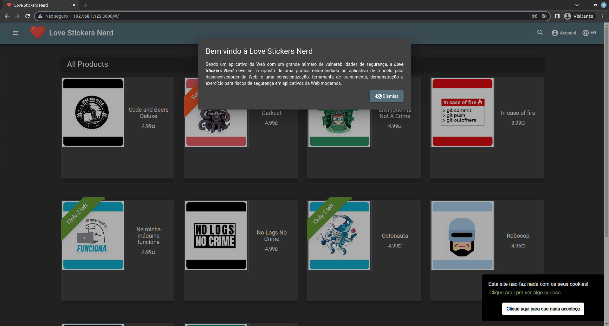

#  Love Stickers Nerd

```
***************** P-R-E-R-I-G-O ☠️ ***********************
Não execute esta aplicação em um ambiente web ou 
junto com outras aplicações de produção. 
*********************************************************
```
Sendo um aplicativo da Web com um grande número de vulnerabilidades de segurança, a **Love Stickers Nerd** deve ser o oposto de uma prática recomendada ou aplicativo de modelo para desenvolvedores da Web: é uma conscientização, ferramenta de treinamento, demonstração e exercício para riscos de segurança em aplicativos da Web modernos.

**Leia as recomendações de segurança [clicando aqui](./config/README.md).**  

# Linux - Docker

<div style="display: inline_block"><br>
  <h3 align="left">Requisitos:</h3>
  <ul>
    <li>Navegador web Firefox e Google Chrome</li>
    <li>Docker e docker-compose</li>
  </ul>  
</div>
<br> 

<details>
    <summary><b>Instalação Docker e docker compose - Linux</b></summary>  
      <pre>
        sudo apt install -y docker.io docker-compose
        # add usuario ao grupo docker
        sudo usermod -aG docker $USER
        # pode ser necessário reiniciar a sessão para aplicar as permissões ao usuário
      </pre>
  </details><br>

```bash
git clone https://github.com/jeanrodrigues/owasp-juice-shop.git
cd owasp-juice-shop/
docker-compose up --build -d
```

Após iniciar a aplicação, acesse no seu navegador o seguinte endereço: [http://127.0.0.1:3000](http://127.0.0.1:3000).  

Se tudo ocrreu bem você deverá ver a tela de boas vindas:  


## Reiniciando a aplicação 

Utilize o comando abaixo caso queira reiniciar o progresso. Talvez seja necessário a limpeza de cache do navegador.
```bash
docker-compose up --force-recreate -d
```

# Windows/Linux - VirtualBox  

<div style="display: inline_block"><br>
  <h3 align="left">Requisitos:</h3>
  <ul>
    <li>Navegador web Firefox e Google Chrome</li>
    <li>Oracle VirtualBox (Versão 6.1 recomendada)</li>
  </ul>  
</div>
<br> 

## Clique [aqui](https://s3.amazonaws.com/eua.cloud2.superlogica.com/owasp-juice-shop/Love_Stickers_Nerd.ova) para fazer o download da imagem para VirtualBox.

- md5sum: `5da1b9a876777599718711be2e0d10fd`

- sha256sum: `ac43c85493450074418ad124ced1e46d9033b6a9fdf4bf43e44cf3ccf9c7a6de`

1. Importe a máquina virtual
1. Inicie a máquina virtual


**Observe no banner o endereço de IP atribuido a máquina.** Caso o endereço não apareça, você pode reiniciar a máquina ou obter o endereço depois de fazer login nela.  

## Usuário e senha
- Login: `superusuario`
- password: `superusuario`

```bash
# obter endereço de ip
ip addr
```

**Utilize o acesso a máquina virtual** para resolver o desafio 2. Broken Authentication/Bruteforce de senha na conta do administrador.

Após iniciar a máquina virtual acesse no seu navegador utilizando o **ip mostrado no banner da máquina virtual**, ex: [http://192.168.1.125:3000/](http://192.168.1.125:3000/).  

Se tudo ocrreu bem você deverá ver a tela de boas vindas:  



# Desafio

Vamos utilizar o aplicativo Web vulnerável baseado no [Pwning OWASP Juice Shop](https://pwning.owasp-juice.shop/) para aprender a identificar e explorar vulnerabilidades comuns de aplicativos Web.

Após implementar a aplicação **Docker** ou **Virtualbox**, vá para o [Desafio](DESAFIO.md).
